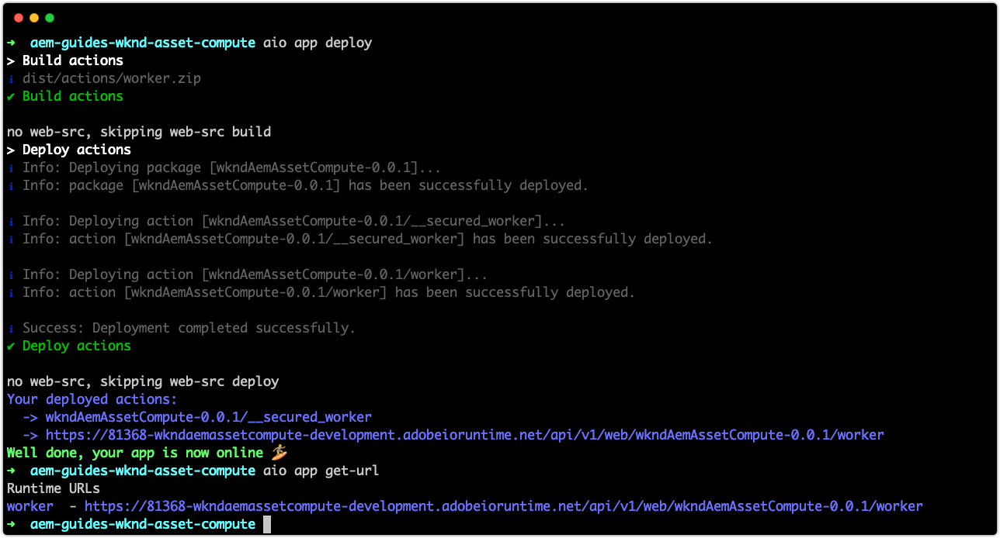
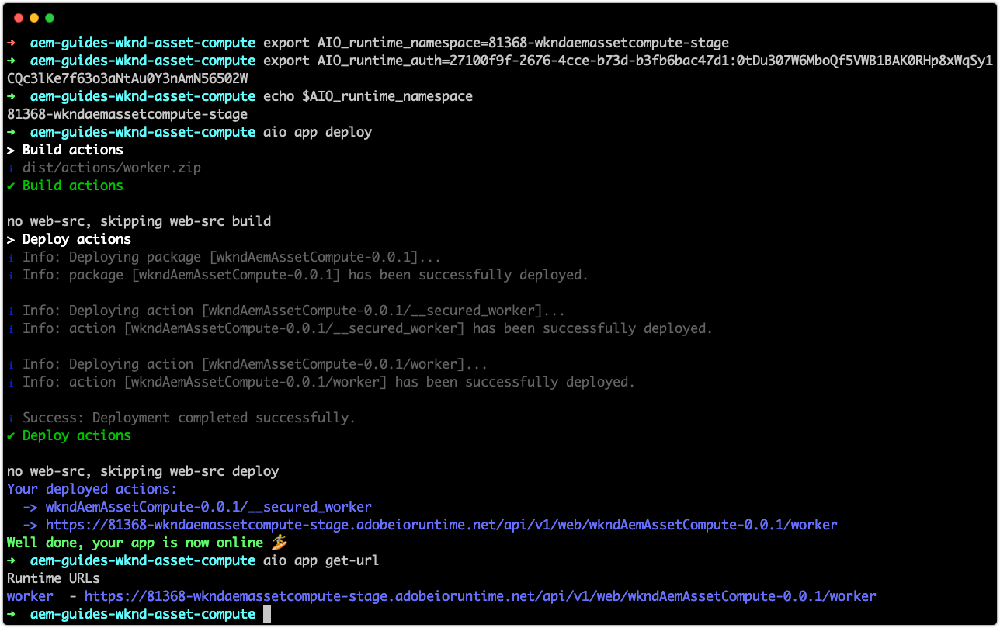
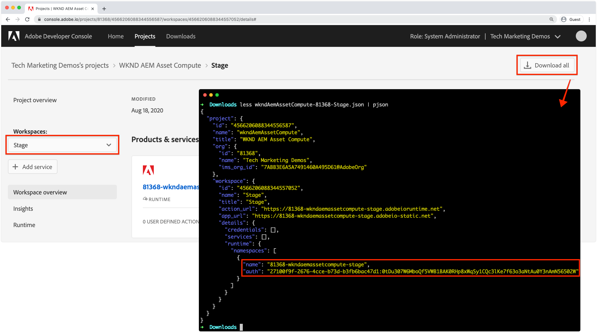

Only the AIO_runtime_namespace and AIO_runtime_auth for the correct workspace are necessary for deployment. I think this document will help explain: https://www.adobe.io/apis/experienceplatform/project-firefly/docs.html#!AdobeDocs/project-firefly/master/guides/deployment.md

I'm pretty sure these could be set locally as environment variables, not in a .env file, just locally via bash:

export AIO_runtime_namespace=*

export AIO_runtime_auth=*

(I have not tried this to confirm, but I don't see any reason why this wouldn't work.)

https://wiki.corp.adobe.com/pages/viewpage.action?spaceKey=DMSArchitecture&title=KT+-+AEM+Assets+-+Asset+Compute+Microservices+%28Nui%29+Extensibility

https://docs.adobe.com/content/help/en/asset-compute/using/extend/deploy-custom-application.html

## Deploy

Asset Compute applications must be deployed to Adobe I/O Runtime in order for them to be used by AEM as a Cloud Services. 

When deploying to Adobe I/O Runtime for use by AEM as a Cloud Service Author services, rather than for local development, only two environment variables are required:

+ `AIO_runtime_namespace` points the Adobe Project Firefly Workspace to deploy to.
+ `AIO_runtime_auth` are the Adobe Project Firefly workspace's authentication credentials.

## Deploy to Adobe I/O Runtime

When deploying to different workspaces in the Adobe I/O Runtime, it is necessary to ensure sure that any Adobe I/O itegration the deployed Asset Compute applications rely on are added to those workspaces as APIs.

## Development workspace

Because we generated this project using `aio app init` and selected the `Development` workspace, `AIO_runtime_namespace` is automatically set to `81368-wkndaemassetcompute-development` with the corresponding `AIO_runtime_auth` in our local `.env` file. 

If an `.env` file exists in the directory used to issue the deploy command, its values are used.

To deploy to the Workspace define in the projects `.env` file:

1. Open a new terminal window in the root of the Asset Compute application project
1. Execute the command `aio app deploy`
1. Execute the command `aio app get-url` to obtain the URL to be used in the AEM as a Cloud Service Processing Profile to reference this custom Asset Compute worker. If the project contained multiple worker implmentations, discrete URLs for each worker is listed.

## Stage and Production workspaces

Deploying to Stage and Production workspaces are typically done by your CI/CD system of choice. The Asset Compute application must be deployed to each Workspace (Stage and then Production) discretely.

Setting true environment variables overrides values for the same-named variables in `.env`.

The general approach, typically automated by a CICD system, for deploying to Stage and Production environments is as follows:

1. Ensure the `aio` npm modules are installed and available
1. Check out the Asset Compute application to deploy from Git
1. Set the all environment variables with the values that correspond to the target workspace (Stage or Production). The two required variables are `AIO_runtime_namespace` and `AIO_runtime_auth` and are obtained per workspace in Adobe I/O Developer Console via the Workspace's __Download All__ feature.

The values fotr these keys can be set by issuing export commands from the terminal:

    + `$ export AIO_runtime_namespace=81368-wkndaemassetcompute-stage`
    + `$ export AIO_runtime_auth=27100f9f-2676-4cce-b73d-b3fb6bac47d1:0tDu307W6MboQf5VWB1BAK0RHp8xWqSy1CQc3lKe7f63o3aNtAu0Y3nAmN56502W`
   
    If your Asset Compute workers require any other variables, such at cloud storage, these should be exported as environment variables as well. For example, our example code depends on Azure Blob Storage to transport the rendition back to the worker, if we were to use discrete Azure Blob Storage for Stage or Production, these could be exported using the corresponding keys defined in `.env` but provided 
    
    + `$ export AZURE_STORAGE_ACCOUNT=<STAGE STORAGE ACCOUNT >`
    + `$ export AZURE_STORAGE_KEY=<STAGE STORAGE KEY>`
    + `$ export AZURE_STORAGE_CONTAINER_NAME=<STAGE CONTAINER NAME>`
    
    These credentials likely differ between Development and Stage or Production environments as well, so ensure they are set accordingly.
1. Once all the environment variables are set for the target workspace to deploy to, execut the deploy command:
    + `aio app deploy`
1. The URL referenced by the AEM as a Cloud Service Processing Profile is also available via:
    + `aio app get-url`.
Remember, if the Asset Compute application version changes (in the `package.json`) the URL to the worker will also change to reflect the new version, and the URL will need to be updated in the Processing Profile.

## Deployment to AEM as a Cloud Service

To use the custom Asset Compute workers, they must be referenced in AEM as a Cloud Service Author service via a Processing Profile.

1. Login to AEM as a Cloud Service Author service as an AEM Administrator
1. Navigate to __Tools > Assets > Processing Profiles__
1. Tap __Create__ button
1. Provide a meaningful name for the Processing Profile, `XX`
1. Tap the __Custom__ tab, and tap __Add New__
1. Define the new service
    + __Rendition name:__ `XXX`
        + The file name rendition that will be used to identify this rendition in AEM Assets
    + __Extension:__ `png`
        + The extension of the rendition that will be generated. Set to `png` as this is the supported output format the worker's web service supports.
    + __Endpoint:__ `https://81368-wkndaemassetcompute-development.adobeioruntime.net/api/v1/web/wkndAemAssetCompute-0.0.1/worker`
        + This is th URL to the worker obtained via `aio app get-url`. Ensure the URL points at the correct workspace based on the AEM as a Cloud Service environent the Processing Profile is being configured in.
    + __Service Parameters__
        + Tap `Add Parameter`
            + Key: `maskFormat`
            + Value: `soft`
                + Allowed values per the API are `soft` or `binary`
        + Key/value pairs that are passed into the Asset Compute worker and available via `rendition.instructions` JavaScript object.
    + __Mime Types__
        + __Includes:__ `image/jpeg`, `image/png`
            + Only process assets with these MIME Types using this service configuration. These two MIME types are the only MIME types the worker's web service supports, therefore we'll limit which assets can be processed by the worker.
        + __Excludes:__ `Leave blank`
            + Never process assets with these MIME Types using this service configuration
1. Tap __Save__ in the top right
1. Select the newly created Processing Profile
1. Tap __Apply Profile to Folder(s)__ in the top action bar
1. Select an a folder to apply the Processing Profile to, such as `WKND / XXX / XXX` and tap __Apply__
1. Navigate to the folder the Processing Profile was not applied to via __AEM > Assets > Files__ and tap into  `WKND / XXX / XXX`.
1. Upload a [new asset](./asset/new-asset.png) to this folder, and wait for it to be processed.
1. Tap into the asset
1. Open the __Renditions__ view from the left sidebar
1. Tap on the asset named `XXX` and review the generated rendition

