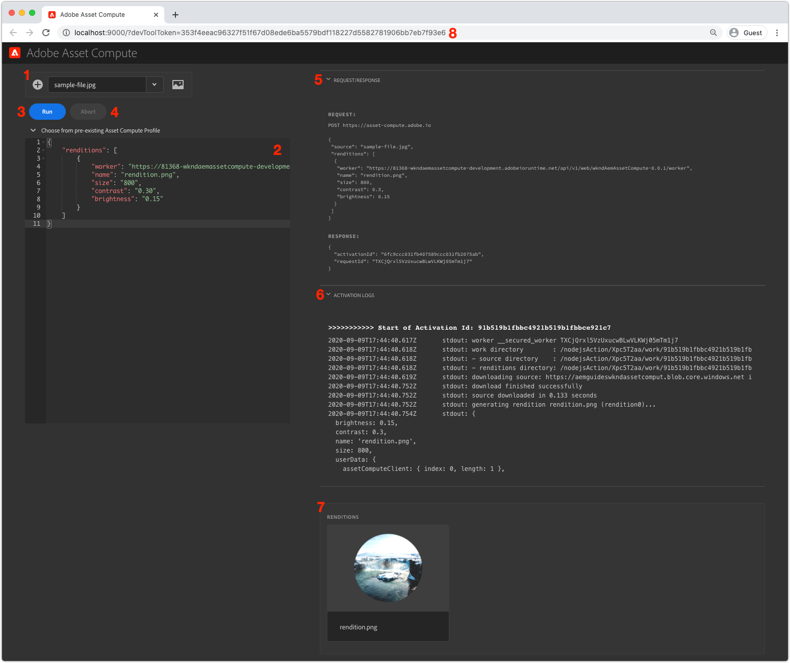
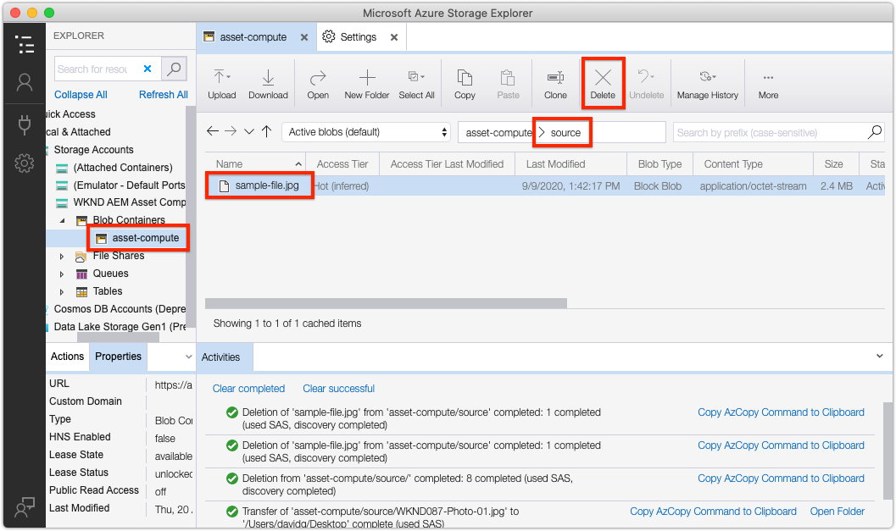

# Asset Compute Dev Tool

The Asset Compute Local Dev Tool is a web-harness that allows developers to configure and execute Asset Computer workers locally, outside the context of the AEM SDK against the Asset Compute resources in Adobe Runtime.

## Run the Asset Compute Dev Tool

The Asset Compute Local Dev tool can be run from the root of the Asset Compute application project via the terminal command:

```
$ aio app run
```

This will start the Asset Compute Dev Tool at localhost port 9000, and automatically load it in a browser window. For the Asset Compute Dev Tool to run, [a valid, auto-generated devToolToken must be provided via a query parameter](#troubleshooting__devtooltoken).

## Understand the Asset Compute Dev Tools interface{#interface}



1. __Source file:__ The source file selection is used to upload example source files that can be selected via the dropdown and used as the payload for Asset Compute workers during development.
1. __Asset Compute profile definition:__ Defines the Asset Compute worker to run including parameters: including the worker's URL end-point, the resultant rendition name, and any parameters.
1. __Run:__ The Run button executes the Asset Compute profile as defined in the Asset Compute configuration profile editor.
1. __Abort:__ The Abort button cancels an execution initiated from tapping the Run button.
1. __Request/Response:__ Provides the HTTP request and response to/from the Asset Compute application running in Adobe Runtime. This can be helpful for debugging.
1. __Activation Logs:__ The logs describing the Asset Compute application's execution, along with any errors. This information is aslo available in the `aio app run` standard out.
1. __Renditions:__ Displays all renditions generated by the execution of th Asset Compute application.
1. __devToolToken query parameter:__ The Asset Compute Dev Tool token requires a valid `devToolToken` query parameter to be present. This token is automatically generated every time a new Dev Tool is spawned.

### Run a custom worker

>[!VIDEO](https://video.tv.adobe.com/v/40241?quality=12&learn=on)

1. Ensure Asset Compute Dev Tool is started from your project root using the `aio app run` command.
1. In the Asset Compute Dev Tool, upload or select a [sample image file](./assets/worker/sample-file.jpg). Ensure it is selected in the __Source file__ dropdown.
1. Review the __Asset Compute profile definition__ text area.
    + The `worker` key defines the URL to the deployed Asset Compute worker.
    + The `name` key defines the name of the rendition to generate.
    + Other key/values can be provied in this JSON object, and will be availabe in the worker under the `rendition.instructions` object.
        + Optionally add values for `size`, `contrast` and `brightness`:

            ```json
            {
                "renditions": [
                    {
                        "worker": "...",
                        "name": "rendition.png",
                        "size":"800",
                        "contrast": "0.30",
                        "brightness": "-0.15"
                    }
                ]
            }
            ```
            
1. Tap the __Run__ button
1. The __Renditions section__ will populate with a rendition place holder
1. Once the worker completes, the rendition placeholder will display the generated rendition

Making code changes to the worker code while Dev Tool is running will "hot deploy" the changes. The "hot deploy" takes several seconds, so allow the deploy to complete before re-running the worker from Dev Tool. 

## Troubleshooting

### Source files dropdown incorrect{#troubleshooting__dev-tool-application-cache}

Asset Compute Dev Tool may enter a state where it pulls stale data, and is most noticable in the 
Source file dropdown, which might display old files or not display 

+ __Error:__ Source file dropdown displays incorrect items.
+ __Cause:__ Stale cached browser state causes the 
+ __Resolution:__ In your browser completely clear the browser tab's application state, the browser cache, local storage and service worker.

### Missing devToolToken query parameter{#troubleshooting__devtooltoken}

+ __Error:__ "Unauthorized" notification in Asset Compute Dev Tool
+ __Cause:__ `devToolToken` is missing or invalid
+ __Resolution:__ Close the Asset Compute Dev Tool browser window, terminate any running Dev Tool processes initiated via the `aio app run` command, and re-start Dev Tool (using `aio app run`).

### Unable to remove source files{#troubleshooting__remove-source-files}

+ __Error:__ There is no way to remove added source files from the Dev Tools UI
+ __Cause:__ This functionality has not been implemented
+ __Resolution:__ Log into your cloud storage provider using the credentials defined in `.env`. Locate the container used by the Dev Tools (also specified in `.env`), navigate into the __source__ folder, and delete any source images. YOu may need to perform the steps outlined in [Source files dropdown incorrect](#troubleshooting__dev-tool-application-cache) if the deleted source files continue to display in the dropdown as thay may be cached locally in the Dev Tools application state.
    

