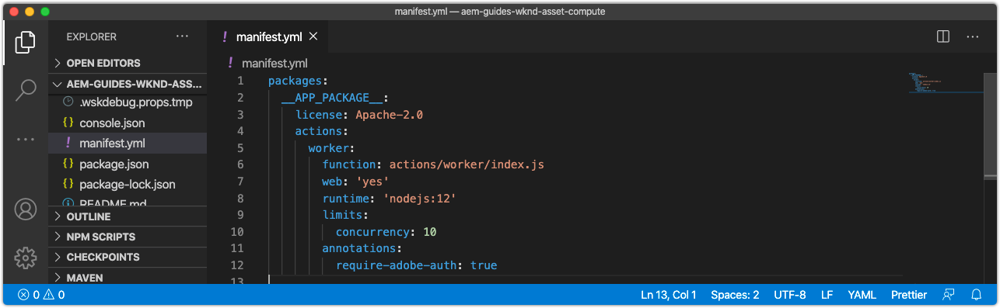

# Configure the manifest.yml

The `manifest.yml`, located in the root of the Asset Compute application project, describes all the workers in this application to be deployed.



## Default worker definition

Workers are defined as Adobe I/O Runtime Action entries under `actions`, and are comprised of a set of configurations. 

Workers accessing other Adobe I/O integrations must set the `annotations -> require-adobe-auth` property to `true` as this [exposes the worker's Adobe I/O credentials](https://docs.adobe.com/content/help/en/asset-compute/using/extend/develop-custom-application.html#access-adobe-apis) via the `params.auth` object. This is  typically required when the worker calls out to Adobe I/O APIs such as the Adobe Photoshop, Lightroom or Sensei APIs, and can be toggled per worker.

1. Open and review the auto-generated worker `manifest.yml`. Projects that contains multiple Asset Compute workers, must define an entry for each worker under the `actions` array.

```yml
packages:
  __APP_PACKAGE__:
    license: Apache-2.0
    actions: # the array of workers, since we have a single worker there is only one entry beneath actions
      worker: # the auto-generated worker definition
        function: actions/worker/index.js # the entry point to the worker 
        web: 'yes'  # as our worker is invoked over HTTP from AEM Author service
        runtime: 'nodejs:12' # the target nodejs runtime
        limits:
          concurrency: 10
        annotations:
          require-adobe-auth: true # set to true, to pass through Adobe I/O access token/client id via params.auth in the worker, typically required when the worker calls out to Adobe I/O APIs such as the Adobe Photoshop, Lightroom or Sensei APIs.
```          

## Define limits

Each worker can configure the [limits](https://www.adobe.io/apis/experienceplatform/runtime/docs.html#!adobedocs/adobeio-runtime/master/guides/system_settings.md) for its execution context in Adobe I/O runtime. These values should be tuned to provide optimal sizing for the worker, based on the volume and rate of assets it will compute, and the type of work it performs.

Ensure you review [Adobe sizing guidance](https://docs.adobe.com/content/help/en/asset-compute/using/extend/develop-custom-application.html#sizing-workers) before setting limits. Asset Compute workers can run out of memory when processing assets, and the result is the Adobe I/O Runtime execution is killed, so ensure the worker is sized appropriately to handle all candidates assets.

1. Add an `inputs` section to the new `wknd-asset-compute` actions entry. This allows tuning of the Asset Compute worker's overall performance and resource allocation.

```yml
packages:
  __APP_PACKAGE__:
    license: Apache-2.0
    actions: 
      worker:
        function: actions/worker/index.js 
        web: 'yes' 
        runtime: 'nodejs:12'
        limits: # Allows for the tuning of the worker's performance
          timeout: 60000 # timeout in millseconds (1 minute)
          memorySize: 512 # memory allocated in MB; if the worker offloads heavy computational work to other Web services this number can be reduced
          concurrency: 10 # adjust based on expected concurrent processing and timeout 
        annotations:
          require-adobe-auth: true
           
```    

## The finished manifest.yml

The resultant `manifest.yml` looks like:

```yml
packages:
  __APP_PACKAGE__:
    license: Apache-2.0
    actions: 
      worker:
        function: actions/worker/index.js 
        web: 'yes' 
        runtime: 'nodejs:12'
        limits:
          timeout: 60000 # in ms
          memorySize: 512 # in MB
          concurrency: 10 
        annotations:
          require-adobe-auth: true
```

## Validating the manifest.yml

Once the generated Asset Compute `manifest.yml` is updated, run the application local and ensure it starts the Dev Tool successfully.

1. Open a command line in the project root, and start up the Asset Compute Dev Tool to by executing the command:

    ```
    $ aio app run
    ```

1. This starts the local Asset Compute Local Dev Tool at http://localhost:9000 which opens in a new Web browser.
1. Watch the command line output as the Asset Compute Dev Tool intializes and the Web browser window for error messages.
1. To stop the Asset Compute Local Dev Tool, tap `Ctrl-C` in the terminal window that executed `aio app run` to terminate the process.

## Troubleshooting

### Incorrect YAML indentation

+ __Error message:__ YAMLException: bad indentation of a mapping entry at line X, column Y:(via standard out from `aio app run` command)
+ __Cause:__ Yaml files are white-spaced sensitive, it likely that your intedentation is incorrect.
+ __Resolution:__ Review your `manifest.yml` and ensure all indentation is correct.

### memorySize limit is set too low

+ __Error message:__  Local Dev Server OpenWhiskError: PUT https://adobeioruntime.net/api/v1/namespaces/xxx-xxx-xxx/actions/xxx-0.0.1/__secured_workeroverwrite=true Returned HTTP 400 (Bad Request) --> "The request content was malformed:requirement failed: memory 64 MB below allowed threshold of 134217728 B"
+ __Cause:__ A `memorySize` limit in the manfest was set beflow the minimum allowed threshold as reported by the error message in bytes.
+ __Resolution:__  Review the `memorySize` limits in the `manifest.yml` and ensure they are all large than the minimum allowed threshold.