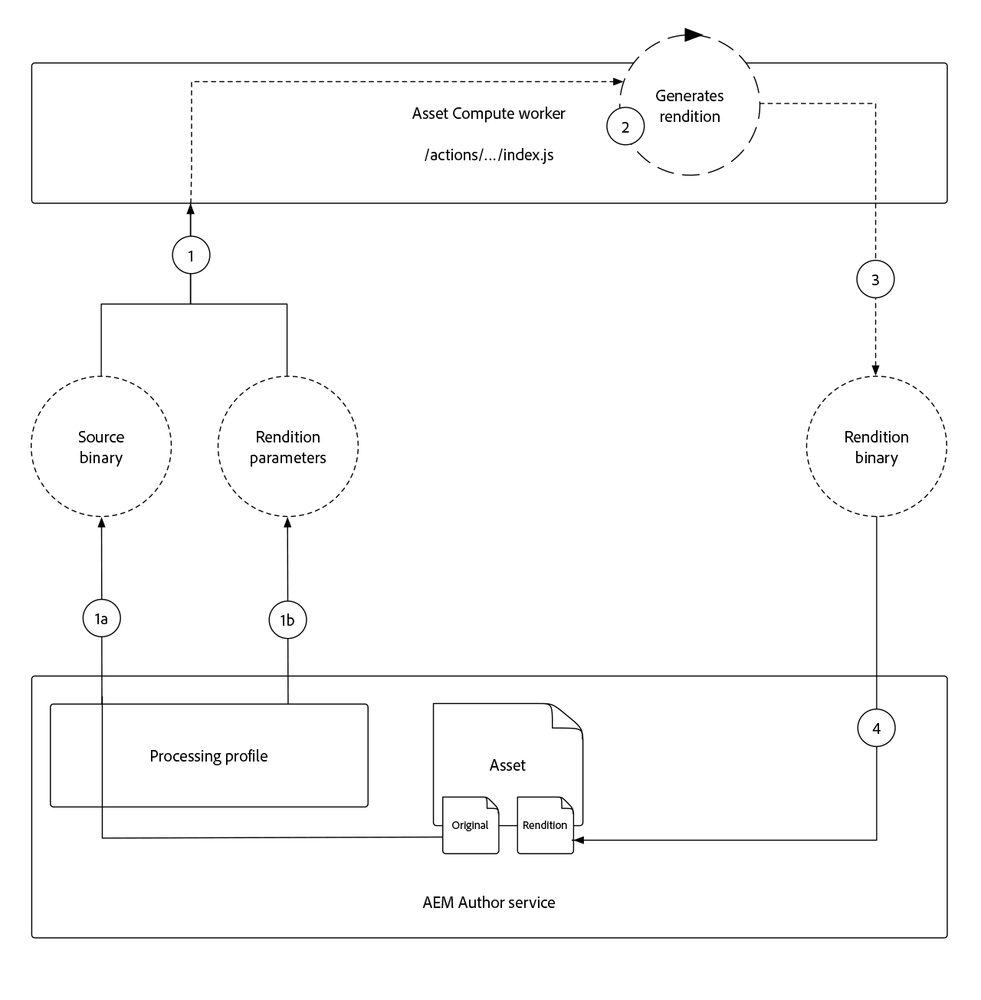
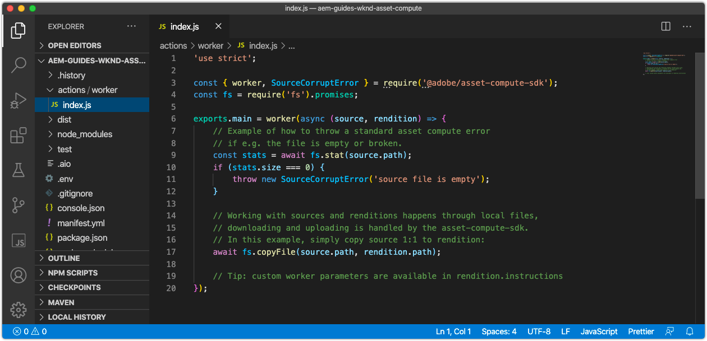
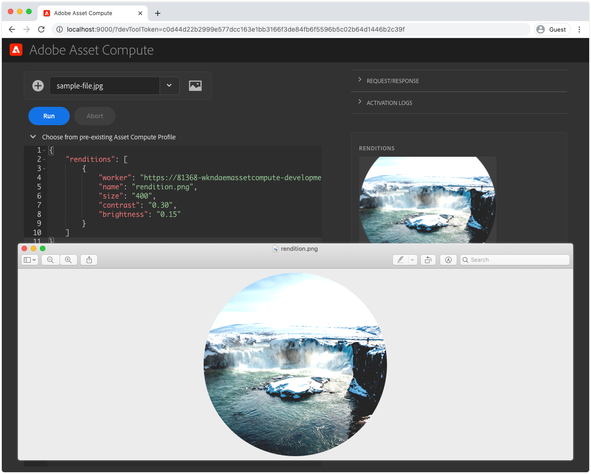

# Develop an Asset Compute worker

Asset Compute workers are the core of an Asset Compute application as provide custom functionality that performs, or orchestrates, the work performed on an asset to create a new rendition.

The Asset Compute project auto-generates a simple worker that copies the asset's original binary into a named rendition, without any transformations. In this tutorial we'll modify this worker to make a more interesting rendition, to illustrate the power of Asset Compute workers.

We will create am Asset Compute worker that generates a new horizontal image rendition, that covers empty space to the left and right of the asset rendition with a blurred version of the asset. The width, height and blur of the final rendition will be parameterized.

## Understanding the execution of an Asset Compute worker 

Asset Compute workers implement the Asset Compute SDK worker API contract which is simply:

+ __Input:__ An AEM asset's original asset binary and parameters
+ __Output:__ One or more renditions to be added to the AEM asset



1. When an Asset Compute worker is invoked from AEM Author service, it is against an AEM asset via a Processing Profile. The asset's __(1a)__ original binary is passed to the worker via rendition callback function's `source` parameter, and __(1b)__ any parameters defined in the Processing Profile via `rendition.instructions` parameter set.
1. The Asset Compute worker code transforms the source binary provides in __(1a)__ based on any parameters provided by __(1b)__ to generate a rendition of the source binary.
    + In this tutorial the rendition is created "in process", meaning the worker composes the rendition, however the source binary can be sent to other Web service APIs for rendition genereation as well.
1. The Asset Comopute worker saves the rendition's binary representation to `rendition.path` which makes it available to be saved into the AEM Author service.
1. Upon completion, the binary data written to `rendition.path` is exposed via the AEM Authoer Service as a rention for the AEM asset the Asset Compute worker was invoked upon.

## Anatomy of a worker

All Asset Compute workers follow the same basic structure and input/output contract.

```javascript
'use strict';

// Any npm module imports used by the worker
const { worker, SourceCorruptError } = require('@adobe/asset-compute-sdk');
const fs = require('fs').promises;

/**
Exports the worker implemented by a custom rendition callback function, which parameterizes the input/output contract for the worker.
 + `source` represents the asset's original binary used as the input for the worker.
 + `rendition` represents the worker's output, which is the creation of a new asset rendition.
 + `params` are optional parameters, which map to additional key/value pairs, including a sub `auth` object that contians Adobe I/O access credentials.
**/
exports.main = worker(async (source, rendition, params) => {
    // Perform any necessary source (input) checks
    const stats = await fs.stat(source.path);
    if (stats.size === 0) {
        // Throw appropriate errors whenever an erring condition is met
        throw new SourceCorruptError('source file is empty');
    }

    // Access any custom parameters provided via the Processing Profile configuration
    let param1 = rendition.instructions.exampleParam;

    /** 
    Perform all work needed to transform the source into the rendition.
    
    The source data can be accessed:
        + In the worker via a file available at `source.path`
        + Or via a presigned GET URL at `source.url`
    **/
    if (success) {
        // A successful worker must write some data back to `renditions.path`. 
        // This example performs a trivial 1:1 copy of the source binary to the rendition
        await fs.copyFile(source.path, rendition.path);
    } else {
        // Upon failure an Asset Compute Error (exported by @adobe/asset-compute-commons) should be thrown.
        throw new GenericError("An error occurred!", "example-worker");
    }
});

/**
Optionally create helper classes or functions the worker's rendition callback function invokes to help organize code.

Code shared across workers, or to complex to be managed in a single file, can be broken out across supporting JavaScript files in the project and imported normally into the worker. 
**/
function customHelperFunctions() { ... }
```

## Opening the worker index.js



1. Ensure the Asset Compute project is open in VS Code
1. Navigate to the `/actions/worker` folder
1. Open the `index.js` file

This is the worker JavaScript file we will modify in this tutorial.

## Install and import supporting npm modules

As Node.js applications, Asset Compute applications benefit from the robust [npm module ecosystem](https://npmjs.com). To leverage npm modules we must first install them into our Asset Compute application project.

In this worker, we leverage the [jimp](https://www.npmjs.com/package/jimp) to create and manipulate the rendition image directly in the Node.js code.

1. Open the command line in the root of your Asset Compute project (this can be done in VS Code via __Terminal > New Terminal__) and execute the command:

    ```
    $ npm install jimp
    ```

1. Import the `jimp` module into the worker code so it can be used via the `Jimp` JavaScript object. 
Update the `require` directives at the top of the worker's `index.js` to import the `Jimp` object from the `jimp` module:

    ```javascript
    'use strict';

    const { Jimp } = require('jimp');
    const { worker, SourceCorruptError } = require('@adobe/asset-compute-sdk');
    const fs = require('fs').promises;

    exports.main = worker(async (source, rendition, params) => {
        // Check handle a corrupt input source
        const stats = await fs.stat(source.path);
        if (stats.size === 0) {
            throw new SourceCorruptError('source file is empty');
        }

        // Do work here
    });
    ```

## Read parameters

Asset Compute workers can read in parameters that can be passed in via Processing Profiles defined in AEM as a Cloud Service Author service. The parameters are passed into the worker via the `rendition.instructions` object.

These can be read by accessing `rendition.instructions.<parameterName>` in the worker code.

Here we'll read in the renditions target `SIZE`, `BRIGHTNESS` and `CONTRAST`, providing default values if none have been provided via the Processing Profile.

We will also compute the target rendition `FORMAT` by reading the rendition's target filename extension to ensure the target format supports transparency.

```javascript
'use strict';

    const { Jimp } = require('jimp');
const { worker, SourceCorruptError } = require('@adobe/asset-compute-sdk');
const fs = require('fs').promises;

exports.main = worker(async (source, rendition, params) => {
    const stats = await fs.stat(source.path);
    if (stats.size === 0) {
        throw new SourceCorruptError('source file is empty');
    }

    // Read in parameters and set defaults if parameters are provided
    const SIZE = rendition.instructions.size || 1200; 
    const CONTRAST = rendition.instructions.contrast || 0;
    const BRIGHTNESS = rendition.instructions.brightness || 0;

    // Parse the format from the rendition's extension
    const FORMAT = rendition.instructions.name.substring(rendition.instructions.name.lastIndexOf('.') + 1);

    // Do work here
}
```

## Throwing errors{#errors}

Asset Compute workers may encounter situations that result in errors. The Adobe Asset Compute SDK provides [a suite of predefined errors](https://github.com/adobe/asset-compute-commons#asset-compute-errors) that can be thrown when such situations are encountered. If no specific error type applies, the `GenericError` can be used, or specific custom `ClientErrors` can be defined.

Before starting to process the rendition, check to ensure all the parameters are valid and supported in the context of this worker:

+ Ensure the rendition format is supported by this worker. In this case we will support `jpg`, `png` and `gif`.
    + We can derive the rendition formation from the `rendition.name`'s extension. If an unsupported extension is detected, throw a `RenditionFormatUnsupportedError` error.
+ Ensure the rendition intruction parameters for `size`, `contrast`, and `brightness` are valid. If not, throw a custom error `RenditionInstructionsError`.
    + We can define this custom class, that extends `ClientError`, at the bottom of this file. The use of a specific, custom error will be useful when [writing tests](../test-debug/test.md) for our worker.

Note these provided error types must also be imported in order to be used.

```javascript
'use strict';

const { Image } = require('image-js'); 
// Import the Asset Compute SDK provided `RenditionFormatUnsupportedError` and `ClientError` 
const { worker, SourceCorruptError, RenditionFormatUnsupportedError, ClientError } = require('@adobe/asset-compute-sdk');
const fs = require('fs').promises;

exports.main = worker(async (source, rendition, params) => {
    const stats = await fs.stat(source.path);
    if (stats.size === 0) {
        throw new SourceCorruptError('source file is empty');
    }

 // Read in parameters and set defaults if parameters are provided
    const SIZE = rendition.instructions.size || 1200; 
    const CONTRAST = rendition.instructions.contrast || 0;
    const BRIGHTNESS = rendition.instructions.brightness || 0;

    // Parse the format from the rendition's extension
    const FORMAT = rendition.instructions.name.substring(rendition.instructions.name.lastIndexOf('.') + 1);

    if (['jpg', 'png', 'gif'].indexOf(FORMAT) === -1) {
        // Ensure rendition format is supported

        // Notice the `RenditionFormatUnsupportedError` is now imported above via the `@adobe/asset-compute-sdk` which proxies the errors in from '@adobe/asset-compute-commons`
        throw new RenditionFormatUnsupportedError(`Rendition format '${FORMAT}' is not supported`);
    } else if (SIZE <= 10 || SIZE >= 10000) {
        // Ensure size is within allowable bounds
        throw new RenditionInstructionsError("'size' must be between 10 and 1,0000");
    } else if (CONTRAST <= -1 || CONTRAST >= 1) {
        // Ensure contrast is valid value
        throw new RenditionInstructionsError("'contrast' must between -1 and 1");
    } else if (BRIGHTNESS <= -1 || BRIGHTNESS >= 1) {
        // Ensure contrast is valid value
        throw new RenditionInstructionsError("'brightness' must between -1 and 1");
    }

    // Do work here
}

// Create a new ClientError to handle invalid rendition.instruction values
class RenditionInstructionsError extends ClientError {
    constructor(message) {
        // Provide a:
        // + message: describing the nature of this erring condition
        // + name: the name of the error; usually same as class name
        // + reason: a short, searchable, unique error token that idenfies this error
        super(message, "RenditionInstructionsError", "rendition_instructions_error");

        // Capture the strack trace
        Error.captureStackTrace(this, RenditionInstructionsError);
    }
}
```

## Creating a rendition

With the parameters read, sanitized and validated, code is written to generate the rendition. The pseudo code for the rendition generation is as follows:

1. Create a new `renditionImage` canvas in square dimensions specified via the `size` parameter.
1. Create a `image` object from the source asset's binary
1. Use the __Jimp__ library to transform the image:
    + Scale to fit within the dimensions defined by the `SIZE` parameter value
    + Adjust contrast based on the `CONTRAST` parameter value
    + Adjust brightness based on the `BRIGHTNESS` parameter value
    + Cut a circle from the center of the image
1. Place the transformed `image` into the center of the `renditionImage`
1. Write the composed, `renditionImage` to `rendition.path` so it can saved back into AEM as an asset rendition.

This code is largely working with the [Jimp APIs](https://github.com/oliver-moran/jimp#jimp).

The finished worker `index.js` should look like:

```javascript

'use strict';

const Jimp = require('jimp');
const { worker, SourceCorruptError, RenditionFormatUnsupportedError, ClientError } = require('@adobe/asset-compute-sdk');
const fs = require('fs').promises;

exports.main = worker(async (source, rendition, params) => {
    const stats = await fs.stat(source.path);
    if (stats.size === 0) {
        throw new SourceCorruptError('source file is empty');
    }

    // Read/parse and valid parameters
    const SIZE = rendition.instructions.size || 1200; 
    const CONTRAST = rendition.instructions.contrast || 0;
    const BRIGHTNESS = rendition.instructions.brightness || 0;
    const FORMAT = rendition.instructions.name.substring(rendition.instructions.name.lastIndexOf('.') + 1);

    if (['jpg', 'png', 'gif'].indexOf(FORMAT) === -1) {
        throw new RenditionFormatUnsupportedError(`Rendition format '${FORMAT}' is not supported`);
    } else if (SIZE <= 10 || SIZE >= 10000) {
        throw new RenditionInstructionsError("'size' must be between 10 and 1,0000");
    } else if (CONTRAST <= -1 || CONTRAST >= 1) {
        throw new RenditionInstructionsError("'contrast' must between -1 and 1");
    } else if (BRIGHTNESS <= -1 || BRIGHTNESS >= 1) {
        throw new RenditionInstructionsError("'brightness' must between -1 and 1");
    }

    // Create target rendition image 
    let renditionImage =  new Jimp(SIZE, SIZE, getBackgroundColor(FORMAT));

    // Read and perform transformations on the source binary image
    let image = await Jimp.read(source.path);
    image.scaleToFit(SIZE, SIZE);
    image.contrast(CONTRAST);
    image.brightness(BRIGHTNESS);
    image.circle();

    // Place the transformed image onto the transparent renditionImage in the center

    let center = {
        x: (renditionImage.bitmap.width - image.bitmap.width) / 2,
        y: (renditionImage.bitmap.height - image.bitmap.height) / 2
    };
    renditionImage.composite(image, center.x, center.y);

    // Write the final transformed image to the asset's rendition
    await renditionImage.writeAsync(rendition.path)
});

// Determine the background color based on transparency support for rendition format
function getBackgroundColor(format) {
    if (['png', 'gif'].indexOf(format) !== -1) {
        // Transparent background
        return 0x0;
    } else {
        // Black background
        return '#000000';
    }
}

// Custome error used for renditions.instructions parameter checking
class RenditionInstructionsError extends ClientError {
    constructor(message) {
        super(message, "RenditionInstructionsError", "rendition_instructions_error");
        Error.captureStackTrace(this, RenditionInstructionsError);
    }
}
```

## Running the worker

!

Now that the worker code is complete, and was previously registered and configured in the [manifest.yml](./manfest.md), it can be executed using the local Asset Compute Dev Tool to see the results.

1. From the root of the Asset Compute project
1. Execute `app aio run`
1. Wait for Asset Compute Dev Tool to open in a new window
1. In the __Select a file...__ drop down, select a sample image to process
    + Select a sample image file to use as the source asset binary. 
    + If none exist yet, tap the __(+)__ to the left, and upload a [sample image](./assets/worker/sample-file.jpg) file, and refresh the Dev Tools browser window.
1. Tap __Run__
1. The __Renditions__ rendition previews the generated rendition. Tap the rendition preview to download the full rendition.

    

1. Update `"name": "rendition.png"` requesting the worker to generate a transparent PNG.

    ```
    {
        "renditions": [
            {
                "worker": "...",
                "name": "rendition.png"
            }
        ]
    }
    ```

1. Tap __Run__
1. The __Renditions__ rendition previews the generated rendition. Tap the rendition preview to download the full rendition.

     

### Run the worker with parameters

Parameters, passed in via Processing Profile configurations, can be simulated in Asset Compute Dev Tools by providing them as key/value pairs on the rendition parameter object.

Our code accepts parameters for:

+ `size` defines the size of the rendition (height and width)
+ `contrast` defines the contrast adjust, must be between -1 and 1
+ `brightness`  defines the bright adjust, must be between -1 and 1

These are read in the worker `index.js` via:

+ `rendition.instructions.size`
+ `rendition.instructions.contrast`
+ `rendition.instructions.brightness`

1. Update the rendition parameters to customize the size, contrast and brightness.

    ```
    {
        "renditions": [
            {
                "worker": "...",
                "name": "rendition.png",
                "size": 800,
                "contrast": 0.30,
                "brightness": 0.15
            }
        ]
    }
    ```
    
1. Tap __Run__ again
1. Tap to download and review the generated rendition. 

     

1. Upload other images as Source images, and try running the worker against them with different parameters!


