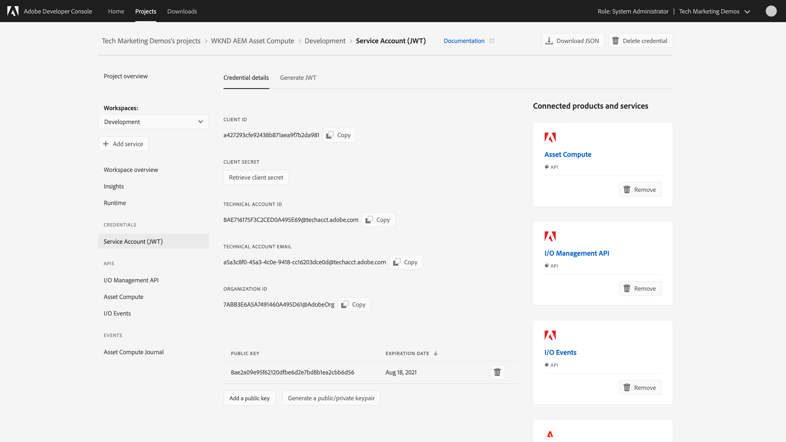

# Set up the Adobe I/O Project Firefly project

## Create and set up an Adobe Project Firefly Adobe I/O project{#set-up}

>[!VIDEO](https://video.tv.adobe.com/v/40183/?quality=12&learn=on)

1. Log in to [Adobe Developer Console](https://console.adobe.io) using the Adobe ID associated with the [accounts and services](./accounts-and-service.md) provisioned for this tutorial.
1. Ensure you are a __System Administrator__ or in the __Developer Role__ for the correct Adobe Org.
1. Create a Firefly project by tapping __Create new project > Project from template > Project Firefly__. 

    _If either __Create new project__ button or the __Project Firefly__ type is not available, this means your Adobe Org is not [provisioned with Project Firefly](#request-adobe-project-firefly)._
    
    + Create a __Project title__, such as `WKND AEM Asset Compute`.
    + The __App name__ must be unique across all Firefly applications and is not modifiable later. Prefixing the your company or organization's name, and postfixing with a meaningful suffix is a good approach, such as `wkndAemAssetCompute`.
        + App names must be unique across and Adobe Org, so for self-enablement it is often best to postfix your name to the App name, such as `wkndAemAssetComputeJaneDoe` to avoid collisions with colleagues.
    + Under __Workspaces__ add a new environment named `Development`.
    + Under __Adobe I/O Runtime__ ensure __Include Runtime with each workspace__ is selected.
    + Tap __Save__ to save the project.
1. In the Firefly Project, select the `Development` workspace in the workspace selector on the left.
1. Tap __+ Add Service > API__ to open the __Add an API__ wizard, use this approach to add the following APIs.

    + __Experience Cloud > Asset Compute__
        + Select __Generate a key pair__ and tap the __Generate keypair__ button, save the automatically downloaded `config.zip` to a safe location for [later use](#private-key).
        + Tap __Next__
        + Select the Product profile __Integrations - Cloud Service__ and tap __Save configured API__
    + __Adobe Services > I/O Events__ and tap __Save configured API__
    + __Adobe Services > I/O Management API__ and tap __Save configured API__

## Access the private.key{#private-key}

When setting up the [Asset Compute API integration](#set-up) a new keypair was generated and a `config.zip` file was automatically downloaded. This `config.zip` contains the generated public certificate and match `private.key` file. 

1. Unzip `config.zip` to a safe place on your file system as the `private.key` will be [used later](../develop/environment-variables.md).
    + Note that secrets and private keys should never be added to Git as a matter of security

## Review the Service Account (JWT) Credentials

This Adobe I/O project's credentials will be used to interacts with the Asset Compute Adobe I/O Runtime, and will need to be incorporated into the Asset Compute application project. Familiarize yourself with the Service Account (JWT) credentials.

1. From the Adobe I/O Project Firefly project, ensure the `Development` workspace is selected.
1. Tap on __Sevice Account (JWT)__ under __Credentials__ on the left.
1. Review the Adobe I/O Credentials displayed.
1. Note the __public key__ listed at the bottom has it's __private.key__ counterpart in the `config.zip` that was downloaded when the __Asset Compute__ API was added to this project.
    + If the private key is lost or compromised, the matching public key can be removed, and a new keypair generated in or uploaded to Adobe I/O using this interface.