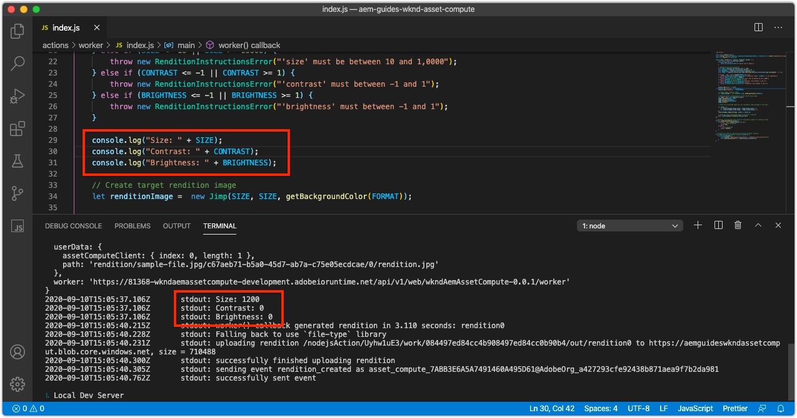
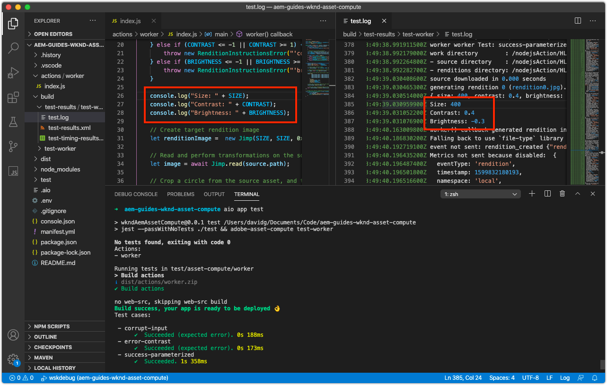
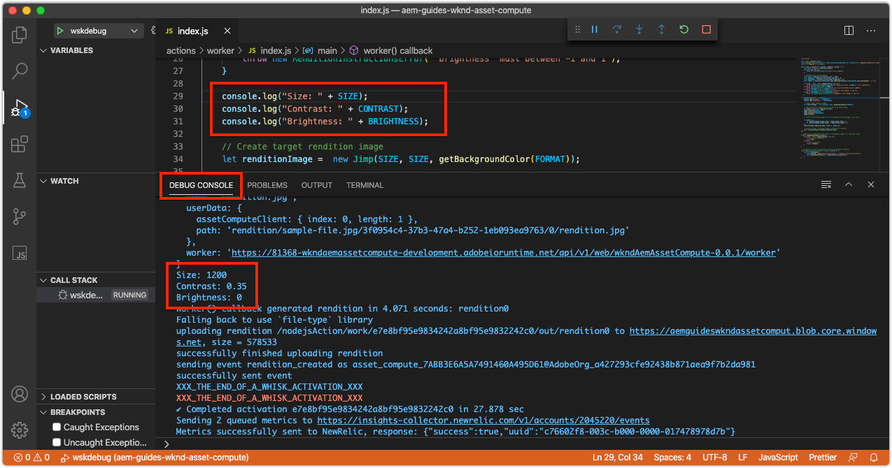
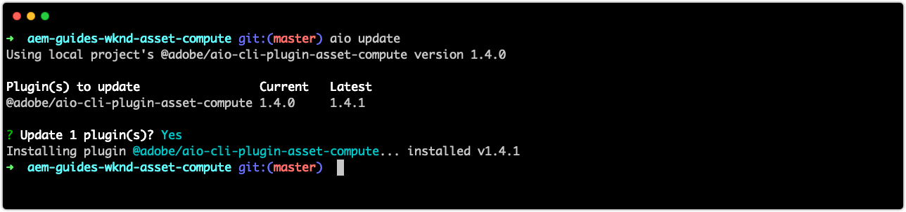

# Debug Asset Compute worker

## Logging

The most basic form of debugging Asset Compute workers is using traditional `console.log(..)` statements in the worker code. The `console` JavaScript object is an implicit, global object so there is no need to import or require it, as it is always present in all contexts. 

These log statements are available for review differently based on how the Asset Compute worker is executed:

+ From `aio app run`, logs print to standard out and the [Dev Tool's](../develop/dev-tool.md) Activation Logs.
    
+ From `aio app test`, logs print to `/build/test-results/test-worker/test.log`.
    
+ Using [wskdebug] logs statements print to the VS Code Debug Console (View > Debug Console), standard out.
    

## wskdebug

>[!WARN] Use Microsoft Visual Studio Code 1.48.0 or greater for compatability with wskdebug

The [wskdebug](https://www.npmjs.com/package/@openwhisk/wskdebug) npm module, provides attaching a debugger to Asset Compute workers, including the ability to set breakpoints in VS Code and step through the code.

<!-- TODO VIDEO -->

1. Ensure [wskdebug](../set-up/development-environment.md#wskdebug) and [ngrok](../set-up/development-environment.md#ngork) npm modules are installed. 
1. Ensure [Docker Desktop and the supporting Docker images](../set-up/development-environment.md#docker) are installed  and running.
1. Close any active running instances of Dev Tool.
1. Deploy the latest code using `aio app deploy`  and record the deployed action name (name between the `[...]`). This will be used to update the `launch.json` in step 8.
    ```
    ℹ Info: Deploying package [wkndAemAssetCompute-0.0.1]...
    ``` 
1. Start a new instance of Asset Compute Dev Tool using the command `npx adobe-asset-compute devtool`
1. In VS Code, tap the Debug icon in the left navigation
    + If prompted, tap __create a launch.json file > Node.js__ to create a new `launch.json` file.
    + Else, tap the __Gear__ icon to the right of the __Launch Program__ dropdown to open the existing `launch.json` in the editor.
1. Add the following JSON object configuration to the `configurations` array:

    ```json
    {
        "type": "pwa-node",
        "request": "launch",
        "name": "wskdebug",
        "attachSimplePort": 0,
        "runtimeExecutable": "wskdebug",
        "args": [
            "wkndAemAssetCompute-0.0.1/__secured_worker",  // Version must match your Asset Compute application's version
            "${workspaceFolder}/actions/worker/index.js",  // Points to your worker
            "-l",
            "--ngrok"
        ],
        "localRoot": "${workspaceFolder}",
        "remoteRoot": "/code",
        "outputCapture": "std",
        "timeout": 30000
    }
    ```

1. Select the new __wskdebug__ from the dropdown
1. Tap the green __Run__ button to the left of __wskdebug__ dropdown
1. Open `/actions/worker/index.js` and tap to the left of the line numbers to add break points 1. Navigate to the Asset Compute Dev Tool Web browser window opened in step 6
1. Tap the __Run__ button to execute the worker
1. Navigate back to VS Code, to `/actions/worker/index.js` and step through the code
1. To exit the debuggable Dev Tool, tap `Ctrl-C` in the terminal that ran `npx adobe-asset-compute devtool` command in step 6

## Troubleshooting

### Debugger does not attach

+ __Error__: Error processing launch: Error: Could not connect ot debug target at... 
+ __Cause__: Docker Desktop is not running on the local system. Verify this by reviewing the VS Code Debug Console (View > Debug Console), confirming this error is reported.
+ __Resolution__: Start [Docker Desktop and confirm the requisite Docker images are installed](../set-up/development-environment.md#docker).

### Breakpoints not pausing

+ __Error__: When running the Asset Compute worker from the debuggable Dev Tool, VS Code does not pause at breakpoints.

#### VS Code debugger is not attached 

+ __Cause:__ The VS Code debugger was stopped/disconnected.
+ __Resolution:__ Restart the VS Code debugger, and verify it attaches by watching the VS Code Debug Output console (View > Debug Console)

#### VS Code debugger attached after worker execution began

+ __Cause:__ The VS Code debugger did not attach prior to tapping __Run__ in Dev Tool.
+ __Resolution:__ Ensure the debugger has attached by reviewing VS Code's Debug Console (View > Debug Console), and then re-run the Asset Compute worker from Dev Tool.

### Worker times out while debugging

+ __Error__: Debug Console reports "Action will timeout in -XXX milliseconds" or [Asset Compute Dev Tool's](../develop/dev-tool.md) rendition preview spins indefinitely or
+ __Cause__: The worker timeout as defined in the [manifest.yml](../develop/manifest.md) is exceeded during debugging.
+ __Resolution__: Temporarily increase the worker's timeout in the [manifest.yml](../develop/manifest.md) or accelerate debugging activites.

### Cannot terminate debugger process

+ __Error__: `Ctrl-C` on the command line does not terminate the debugger process (`npx adobe-asset-compute devtool`).
+ __Cause__: A bug  in `@adobe/aio-cli-plugin-asset-compute` 1.3.x, results in `Ctrl-C` not being recognized as a terminating command.
+ __Resolution__: Update `@adobe/aio-cli-plugin-asset-compute` to version 1.4.0+

    ```
    $ aio update
    ```

    