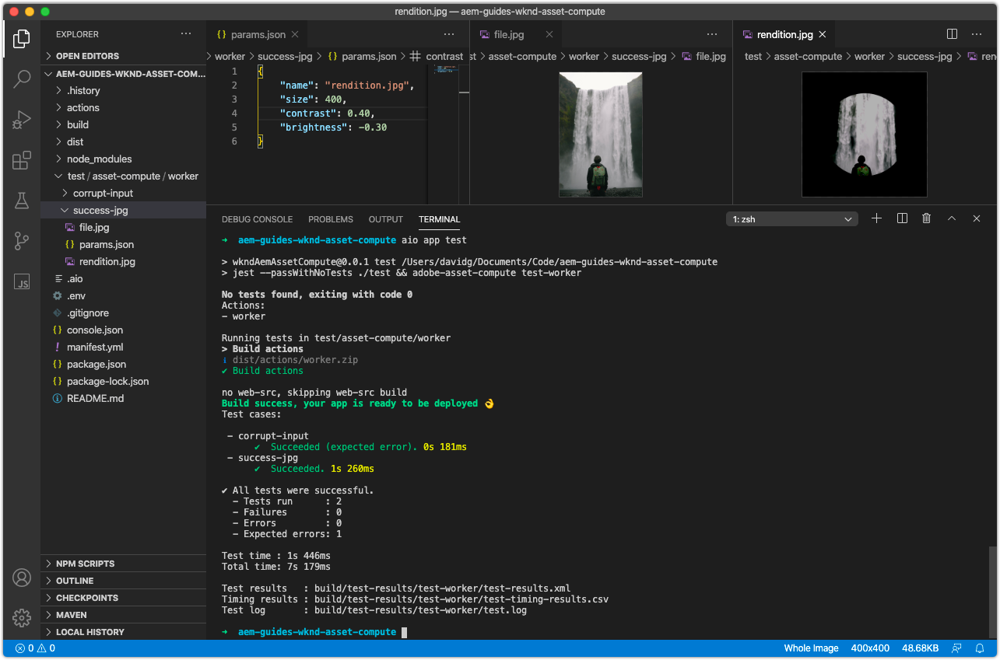
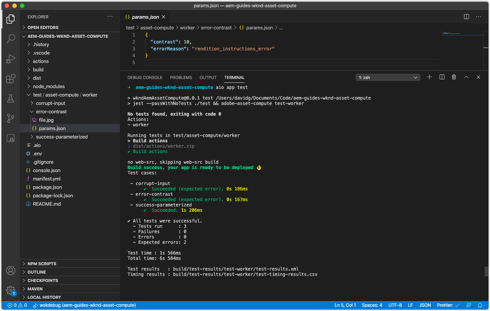

# Test an Asset Compute worker

The Asset Compute project defines a pattern for quickly and easily creating and executing [tests of Asset Compute workers](https://docs.adobe.com/content/help/en/asset-compute/using/extend/test-custom-application.html).

## Anatomy of a worker test

Asset Compute Worker tests are broken into 


```
actions/<worker-name>/index.js
...
test/
  asset-compute/
    <worker-name>/           <--- Test suite for the worker
        <test-case-1>/       <--- Specific test case 
            file.jpg         <--- Input file (ie. `source.path` or `source.url`)
            params.json      <--- Parameters (ie. `rendition.instructions`)
            rendition.png    <--- Expected output file (ie. `rendition.path`)
        <test-case-2>/       <--- Another specific test case for this worker
            ...
```

Each test cast can have the following files:

+ `file.*`: source file to test (extension can be anything except .link) (required)
+ `rendition.*`: expected rendition (required except for error testing)
+ `params.json`: the single rendition json instructions (optional);
+ `validate`: a script that gets expected and actual rendition file paths as arguments and must return exit code 0 if the result is ok, or a non-zero exit code if the validation or comparison failed. (optional, defaults to the diff command)
    + It is suggested to use a shell script that simply wraps a docker run command for using different validation tools.
+ `mock-<HOST_NAME>.json`: json formatted http responses for [mocking external service calls](https://www.mock-server.com/mock_server/creating_expectations.html). (optional)


## Writing a test case

This test case will test the a parameterized input of a JPG successfully generates the expected JPG rendition.

1. First delete the auto-generated `simple-worker` tests case at `/test/asset-compute/simple-worker` as this is now an invalid, as our worker no longer simply copies the source to the rendition.
1. Create a new test-case folder at `/test/asset-compute/worker/success-jpg` to test a successful execution of the worker that generates a JPG rendition.
1. Add the test [input file](./assets/test/success-jpg/file.jpg) for this test case and name it `file.jpg`. This file represents the `source` input file that will be processed by the worker.
1. Add a new file named `params.json` that defines the input parameters of the worker with the contents:
 
    ```json
    { 
        "name": "rendition.jpg",
        "size": 400,
        "contrast": 0.25,
        "brightness": -0.50
    }
    ```
    This passed into the [Dev Tool's Asset Compute profile definition](../develop/dev-tool.md) when running this worker, less the `worker` key.
1. Add the expected [rendition file](assets/test/success-jpg/rendition.jpg) to this test case and name it `rendition.jpg`. This file represents the `rendition` file is output by the worker for the input `file.jpg`. 
1. Run the test suites from the root of the project by executing the command `aio app test`
    + Ensure [Docker Desktop](../set-up/development-environment.md#docker) and supporting Docker images are installed and started
    + Terminate any running Dev Tool instances




## Writing an error checking test case

This test case tests to ensure the worker throws the appropriate error when the `contrast` parameter is set to an invalid value.

1. Create a new test-case folder at `/test/asset-compute/worker/error-contrast` to test a erring execution of the worker due to an invalid `contrast` parameter value.
1. Add the test [input file](./assets/test/error-contrast/file.jpg) for this test case and name it `file.jpg`. This file represents the `source` input file that will be processed by the worker. The contents of this file is immaterial to this test, it just needs to exist to get past the __Corrupt source__ check, in order to reach the `rendition.instructions` validity conditionals, that this test case checks.
1. Add a new file named `params.json` that defines the input parameters of the worker with the contents:
 
    ```json
    {
        "name": "rendition.jpg",
        "contrast": 10,
        "errorReason": "rendition_instructions_error"
    }
    ```
    
    + Set `contrast` parameters to `10`, an invalid value, as contrast must be between -1 and 1 to trigger a `RenditionInstructionsError`.
    + Assert errors are thrown in tests by setting the `errorReason` key to the "reason" associated with the thrown error. This invalid contrast parameter throws the [custom error](../develop/worker.md#errors), `RenditionInstructionsError`, therefore set the `errorReason` to this error's reason, or`rendition_instructions_error` to assert it is thrown.

1. Since no rendition should be generated during an erring execution, no `rendition.*` file is necessary.
1. Run the test suite from the root of the project by executing the command `aio app test`
    + Ensure [Docker Desktop](../set-up/development-environment.md#docker) and supporting Docker images are installed and started
    + Terminate any running Dev Tool instances



## Troubleshooting

### No rendition generated

Test case fails without generating a rendition.

+ __Error:__ Failure: No rendition generated.
+ __Cause:__ The worker failed to generate a rendition due to an unexpected error such as a JavaScript syntax error.
+ __Resolution:__ Review the test execution's `test.log` at `/build/test-results/test-worker/test.log`. Locate the section in this file corresponding to the failing test case, and review for errors.
   

### Test generates incorrect rendition

Test case fails generating an incorrect rendition.

+ __Error:__ Failure: Rendition 'rendition.xxx' not as expected.
+ __Cause:__ The worker output a rendition that was not the same as the `rendition.xxx` provided in the test case. 
    + If the expected `rendition.xxx` file is not created in the exact same manner as the locally generated rendition in the test case, the test may fail as there may be some difference in the bits. If the expected rendition in the test case is saved from Dev Tool, meaning generated within Adobe I/O Runtime, the bits may technically be different, causing the test to fail, even if from a human perspective the expected and actual rendition files are identical.
+ __Resolution:__ Review rendition output from the test by navigating to `/build/test-worker/<worker-name>/<test-run-timestamp>/<test-case>/rendition.xxx`, and compare it to the expected rendition file in the test case.
