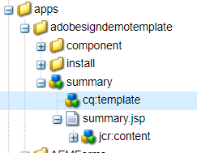

# Customize Summary Step

Summary step component is typically used to display the summary of your form submission. Summary step is typically placed in the last panel of your form. The summary step is typically used in association with Signature Step in the form, after the signing ceremony is complete the summary step is displayed to the user.
For the purpose of this use case we have created a copy of the summary step and extended the capability to include custom clientlib.

The following screen shot shows the new component that was created to display the message on completion of the signing ceremony

The new component is based on the out of the box summary component.

We have added a button to navigate to the next form for signing


The summary.jsp has the following code. It has reference to the client library identified by the category id **getnextform** 

```java
<%--
  Guide Summary Component
--%>
<%@include file="/libs/fd/af/components/guidesglobal.jsp"%>
<%@include file="/libs/fd/afaddon/components/summary/summary.jsp"%>
<ui:includeClientLib categories="getnextform"/>

```


